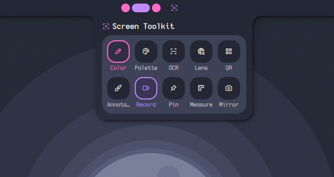
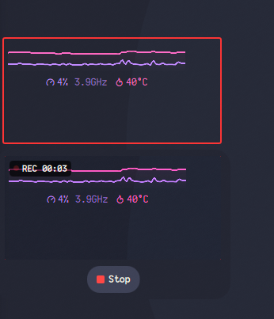
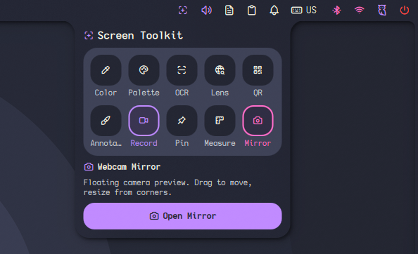

# Screen Toolkit

Screen Toolkit is a Noctalia plugin that groups several screen utilities in one panel.

Tools included:
Color Picker, Annotate, Measure, Pin, Palette, OCR (with translation), QR Scanner, Google Lens, Screen Recorder, and Webcam Mirror.

## Features

**Color Picker**  
Pick any pixel and get HEX, RGB, HSV, and HSL values. Includes copy buttons and color history.  

**Annotate**  
Select a region and draw on it (pencil, arrows, rectangles, text, blur). Save or copy the result.  

**Measure**  
Draw lines to measure pixel distances on screen.  

**Pin**  
Capture a region and keep it pinned as a floating overlay.  

**Palette**  
Extract dominant colors from a selected region.  

**OCR**  
Select a region and extract text. Optional translation is supported.  

**QR Scanner**  
Scan QR codes or barcodes from a selected region.  

**Google Lens**  
Upload a selected region to Google Lens.

**Screen Recorder**  
Record a selected region as MP4 or GIF (max ~15s for GIF). Optional system audio or microphone.  

**Webcam Mirror**  
Floating webcam preview window. Can be moved, resized, and flipped horizontally.  

## Requirements

Required tools:

grim  
slurp  
wl-clipboard  
tesseract  
imagemagick  
zbar  
curl  
translate-shell  
wf-recorder  
ffmpeg  
gifski (only needed for GIF recording)

Additional OCR languages will appear automatically if installed.

## Install packages

### Arch Linux

sudo pacman -S grim slurp wl-clipboard tesseract tesseract-data-eng imagemagick zbar curl translate-shell wf-recorder ffmpeg  
yay -S gifski

### Debian / Ubuntu

sudo apt install grim slurp wl-clipboard tesseract-ocr tesseract-ocr-eng imagemagick zbar-tools curl translate-shell wf-recorder ffmpeg  
cargo install gifski

### Fedora

sudo dnf install grim slurp wl-clipboard tesseract tesseract-langpack-eng ImageMagick zbar curl translate-shell wf-recorder ffmpeg  
cargo install gifski

### openSUSE

sudo zypper install grim slurp wl-clipboard tesseract-ocr tesseract-ocr-traineddata-english ImageMagick zbar curl translate-shell wf-recorder ffmpeg  
cargo install gifski

## Compatibility

Tested on Hyprland and Niri.

## IPC

Tools are exposed through:

plugin:screen-toolkit

Commands:

toggle — open or close the panel  
colorPicker — launch color picker  
ocr — run OCR on a region  
qr — scan QR / barcode  
lens — upload region to Google Lens  
annotate — open annotation tool  
measure — start measuring overlay  
pin — pin a region to screen  
palette — extract colors  
record — start screen recording  
mirror — toggle webcam mirror  

## License

MIT
