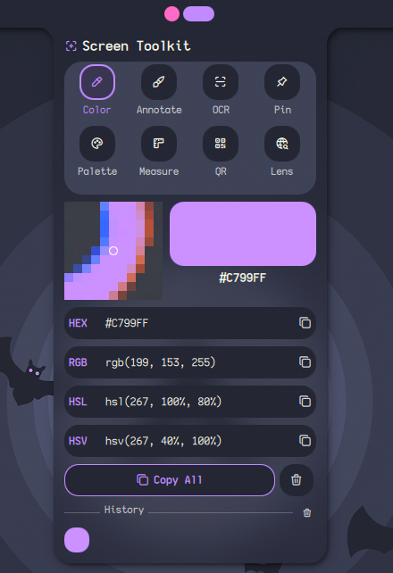
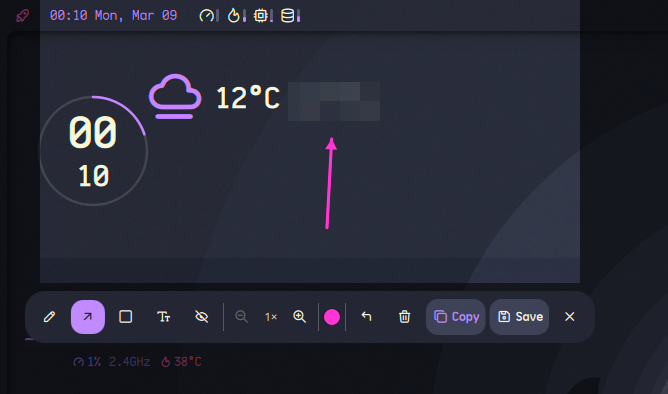
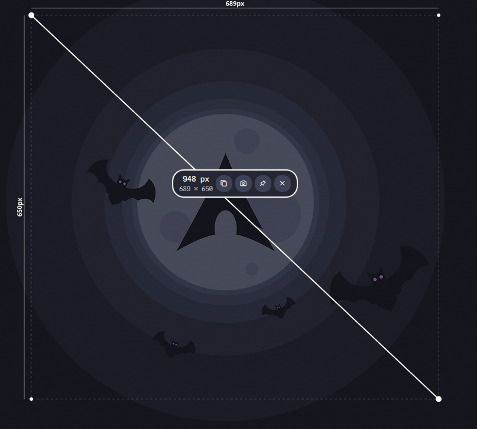
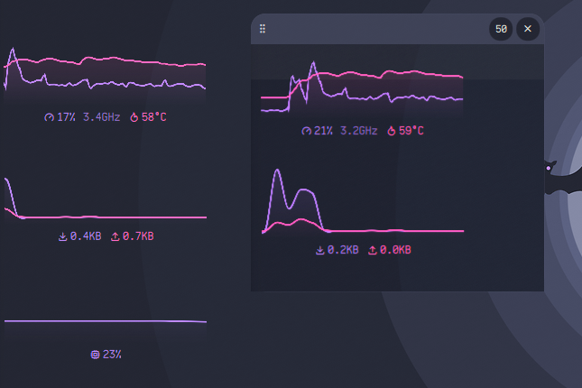
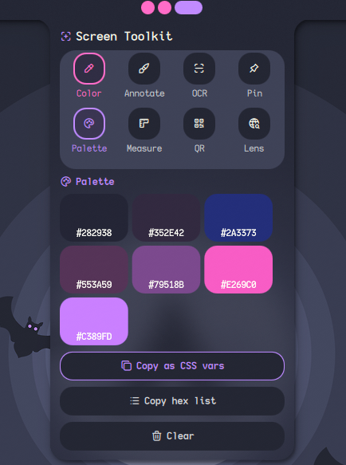
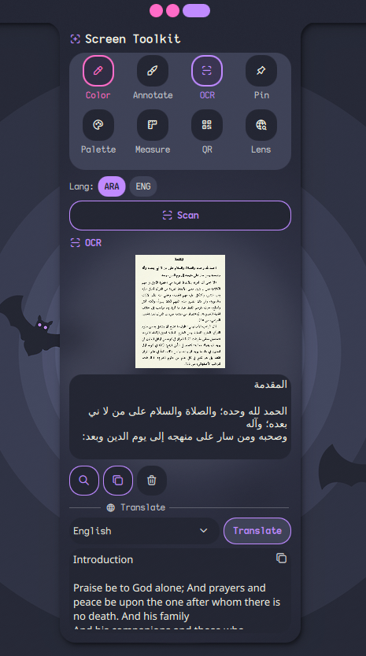
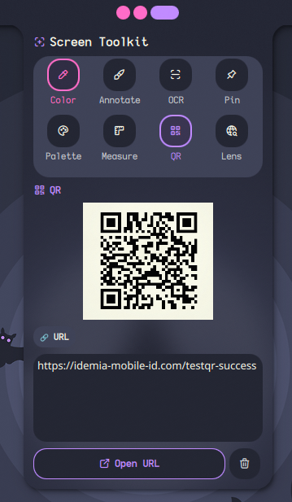

# Screen Toolkit

Screen Toolkit is a Noctalia plugin that provides a set of screen utilities in one panel.  
It includes Color Picker, Annotate, Measure, Pin, Palette, OCR with translation, QR Scanner, and Google Lens.

## Features

**Color Picker**  
Click on any pixel to get HEX, RGB, HSV, and HSL values. Copy any format and view color history.  

**Annotate**  
Capture a region and draw with pencil, arrows, rectangles, text, or blur. Save or copy screenshots.  

**Measure**  
Draw lines on the screen to measure pixel distances. Annotated screenshots are saved automatically.  

**Pin**  
Capture a region and keep it as a floating overlay on your screen.  

**Palette**  
Extract the 8 dominant colors from a region. Copy as hex codes or CSS variables.  

**OCR with translation**  
Select a region, extract text, and optionally translate it.  

**QR Scanner**  
Select a region over any QR code or barcode. Copy the content or open URLs.  

**Google Lens**  
Select a region, upload the image, and open it in Google Lens in your browser.  

## Requirements

You need the following packages installed:  
grim, slurp, wl-clipboard, tesseract, imagemagick, zbar, curl, translate-shell  
Optional OCR languages are detected automatically in the OCR tool settings.

## Install packages on your distro

### Arch Linux
sudo pacman -S grim slurp wl-clipboard tesseract tesseract-data-eng imagemagick zbar curl translate-shell

### Debian / Ubuntu
sudo apt install grim slurp wl-clipboard tesseract-ocr tesseract-ocr-eng imagemagick zbar-tools curl translate-shell

### Fedora
sudo dnf install grim slurp wl-clipboard tesseract tesseract-langpack-eng ImageMagick zbar curl translate-shell

### openSUSE
sudo zypper install grim slurp wl-clipboard tesseract-ocr tesseract-ocr-traineddata-english ImageMagick zbar curl translate-shell

## Compatibility

Tested on Hyprland and Niri.

## IPC Commands

All tools can be triggered using the IPC target `plugin:screen-toolkit`:

toggle — open or close the panel  
colorPicker — launch the pixel color picker  
ocr — select a region and extract text  
qr — select a region and decode QR or barcode  
lens — select a region and upload to Google Lens  
annotate — select a region and open annotation overlay  
measure — open the measure overlay  
pin — select a region and pin it as a floating overlay  
palette — select a region and extract dominant colors

## Example keybinds

### Hyprland
bind = $mod, C, exec, qs -c noctalia-shell ipc call plugin:screen-toolkit colorPicker  
bind = $mod, T, exec, qs -c noctalia-shell ipc call plugin:screen-toolkit ocr

### Niri
Mod+C { spawn "qs" "-c" "noctalia-shell" "ipc" "call" "plugin:screen-toolkit" "colorPicker"; }  
Mod+T { spawn "qs" "-c" "noctalia-shell" "ipc" "call" "plugin:screen-toolkit" "ocr"; }
